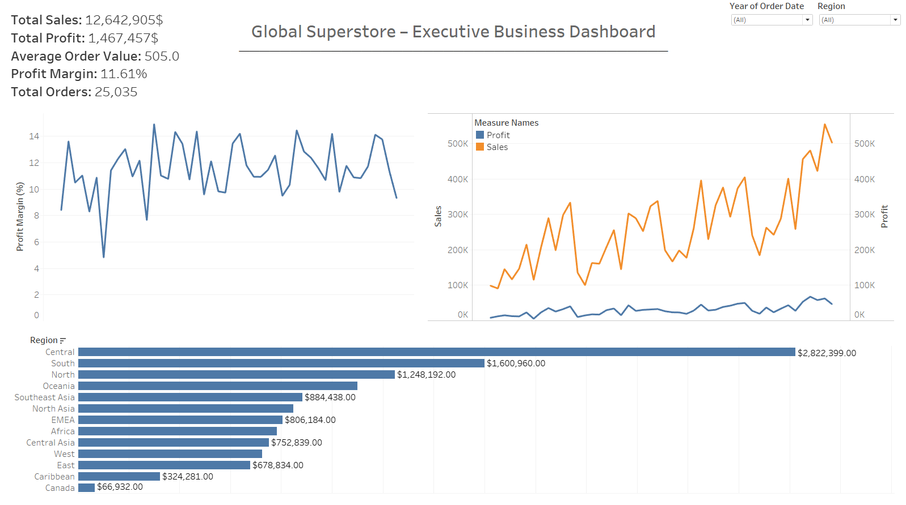
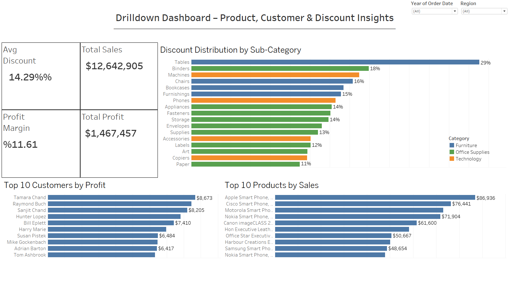

# Global Superstore BI Dashboard

This is a complete Tableau Business Intelligence project exploring sales, profit, and discount dynamics across product categories, customers, and regions using the Global Superstore dataset.

## 🎯 Objectives

- Present executive-level KPIs: Sales, Profit, AOV, Orders, Margin
- Identify top-performing products and most profitable customers
- Analyze discount behavior across sub-categories
- Enable user-driven filtering via interactive controls

## 📊 Dashboard Previews

### Executive Overview



### Drilldown Dashboard



## 🛠️ Tools Used

- Tableau
- Python (for data preparation and mock visualization)
- GitHub

## 📁 Project Structure
```text
├── data/ # Raw and Cleaned dataset
├── dashboards/ # PNG exports of dashboards 
├── workbook/ # Tableau packaged workbook (.twbx)
├── python notebook/ # Python codes 
```

## 📂 Dataset

Global Superstore dataset from Kaggle, including:
- Sales, Profit, Discount, Quantity
- Order Date, Customer Info, Region, Category
- Product Metadata

## 📓 Python Notebook

Includes data exploration, column cleaning, and preparation for Tableau:

- `data_cleaning_and_analysis.ipynb`
